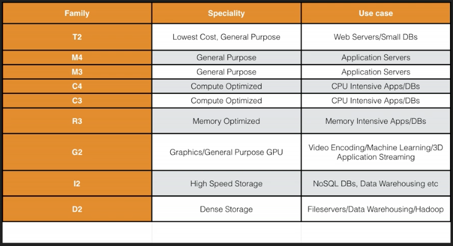

# Elastic Compute Cloud （EC2）

Amazon Elastic Compute Cloud (Amazon EC2) 是一種 Web 服務，可在雲端提供可調整大小的運算容量。該服務旨在降低開發人員進行網路規模運算的難度。

Instance Options

* On Demand
  * 以小時計費、隨需
* Reserved
  * 簽訂 1 至 3 年合約獲得折扣
* Spot
  * 競價型；應用程式必須配合能隨時開始、結束執行運算

Amazon EC2 競價型執行個體可讓您對備用的 Amazon EC2 運算容量進行競價。由於競價型執行個體通常會以低於隨需執行個體定價的折扣價提供，所以能大幅降低執行應用程式的費用，還能以相同的預算來提升應用程式的運算容量和輸送量，並啟用新的雲端運算應用程式類型。「Spot Instances」是很特殊的EC2計價方式，也就是使用類似競標的方式來租用運算資源。這種前所末有的計價方式，讓我們有更多種靈活規劃要使用的運算資源與花費的平衡。

https://ec2price.com/

## AMI, Amazon Machine Images

Amazon Linux was based on RHEL/CentOS

https://aws.amazon.com/marketplace

## EC2 Instance Types



* D: Density
* I: IOPS
* R: RAM
* T: Cheap (T2 Micro)
* M: Main choice
* C: Compute
* G: Graphics

## EBS

Amazon Elastic Block Store (Amazon EBS) 可在 AWS 雲端提供用於 Amazon EC2 執行個體的持久性資料區塊級儲存磁碟區。

* General Purpose SSD (GP2)
* Provisioned IOPS SSED (IO1)
* Magnetic (Standard)

## Outlines

* Launch an EC2 Instance
* Security Group Basics
* Volumes and Snapshots
* Create an AMI
* Load Balancers & Health Checks
* Cloud Watch
* AWS Command Line
* IAM Roles with EC2
* Bootstrap Scripts
* Launch Configuration Groups
* Autoscaling 101
* EFS
* Lambda
* HPC (High Performance Compute) & Placement Groups

## Official AMIs

* Amazon Linux
* Red Hat Enterprise Linux
* SUSE Linux Enterprise Server
* Ubuntu Server
* Microsoft Windows Server

## Volumes and Snapshots

Lab.

```
# create first volume

lsblk
file -s /dev/xvdf
mkfs -t ext4 /dev/xvdf
mkdir /fileserver
mount /dev/xvdf /fileserver
umount /dev/xvdf

# create snapshot from volume
# delete volume
# restore volume from snapshot

mount /dev/xvdf /fileserver
umount /dev/xvdf
```

## Connect to EC2 with PieTTY

PuTTY Key Generator

* http://docs.aws.amazon.com/zh_cn/AWSEC2/latest/UserGuide/putty.html
* http://ckb-blog.logdown.com/posts/158608-aws-ec2

## 延伸閱讀

* https://wiki.jenkins-ci.org/display/JENKINS/Amazon+EC2+Fleet+Plugin
